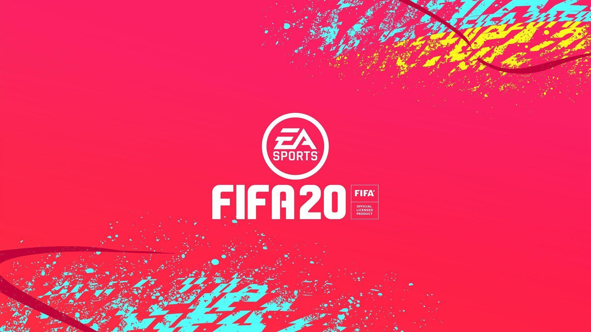

# Let's play FIFA

This repository contains work done as part of AI-2 course by [Univ.ai](https://www.univ.ai/).  
Our team  - Himanshu, Samyak, Amit, Akshul

## Project

Football is arguably the most popular sport in the world and FIFA is the most popular football (soccer) simulation game by Electronic Arts (EA Sports). 
The game is not to be confused with the official International Federation for Football [FIFA](https://www.fifa.com/).

- In this project, we predict a FIFA player's position based on their skill levels, attributes and personal information.

## Data

- The data is adopted from [this Kaggle dataset](https://www.kaggle.com/stefanoleone992/fifa-20-complete-player-dataset) and uploaded [here](https://github.com/HimanS-sys/fifa-player-position-prediction/tree/main/fifadataset).

## Methodology

- We use the **FIFA-19 data for training** and **FIFA-20 data for testing**. 
- We train multiple **Multi Layer Perceptron** models (**simple artificial neural networks**) **with and without Regularization** to understand the difference in performance. The Regularization techniques used are **Early Stopping** and **Dropout Layer**.
- explore the detailed methodology in this [notebook](https://github.com/HimanS-sys/fifa-player-position-prediction/tree/main/Classifying-Player-Position.ipynb).

## Results

### model accuracy comparison

[click here for presentaion.](https://github.com/HimanS-sys/fifa-player-position-prediction/tree/main/FIFA_Project.pdf)
